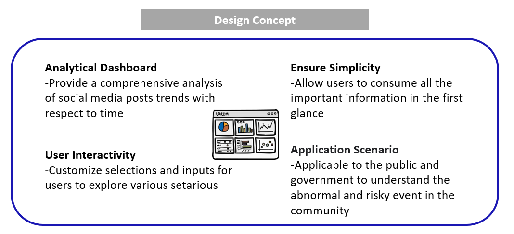
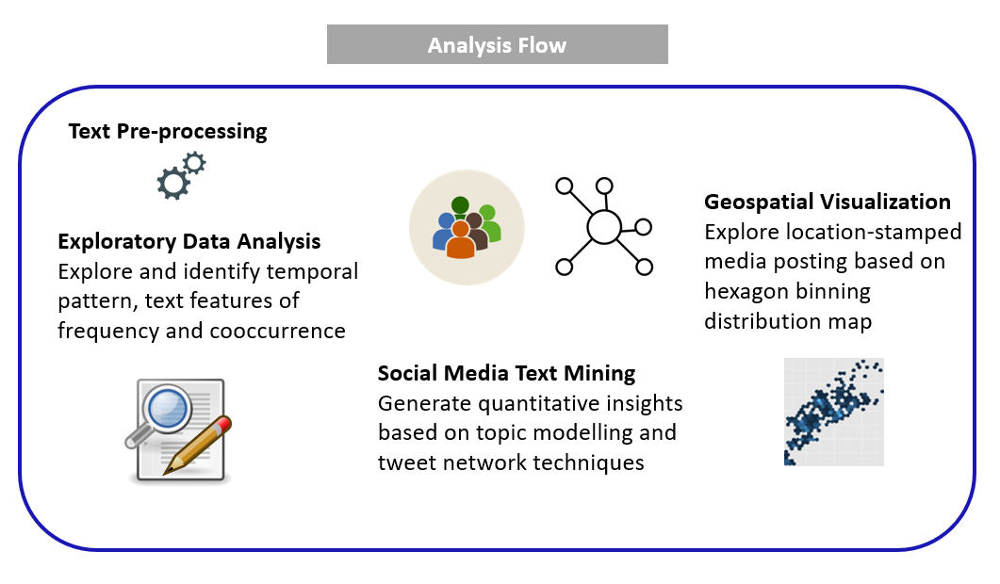
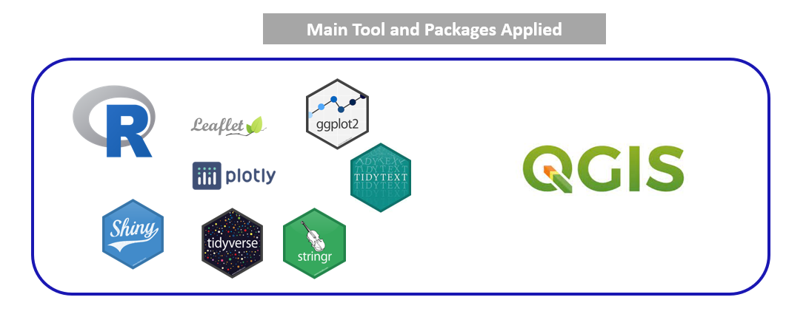
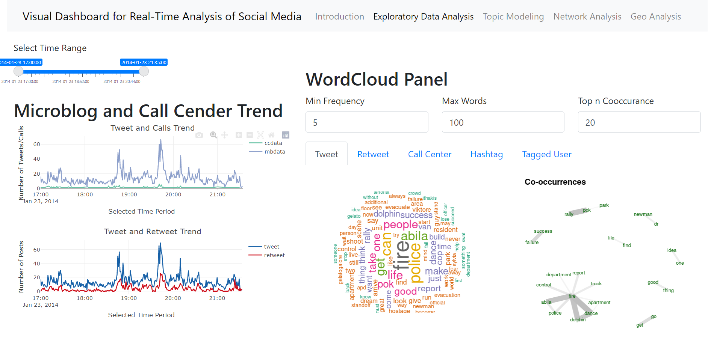
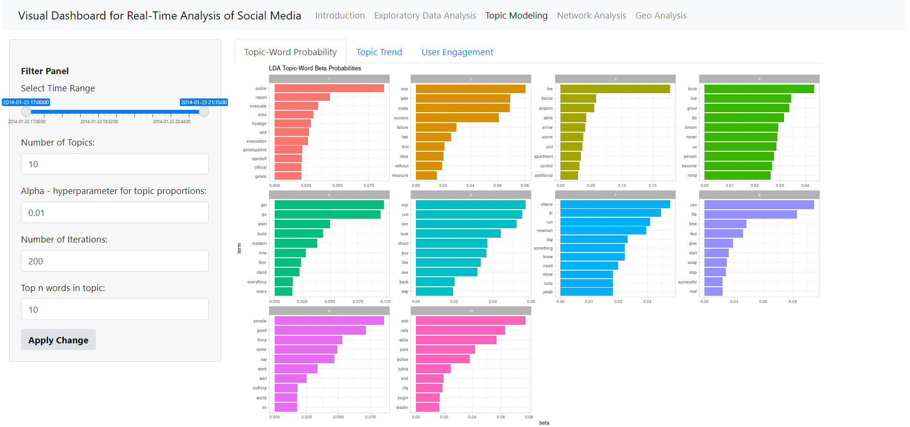
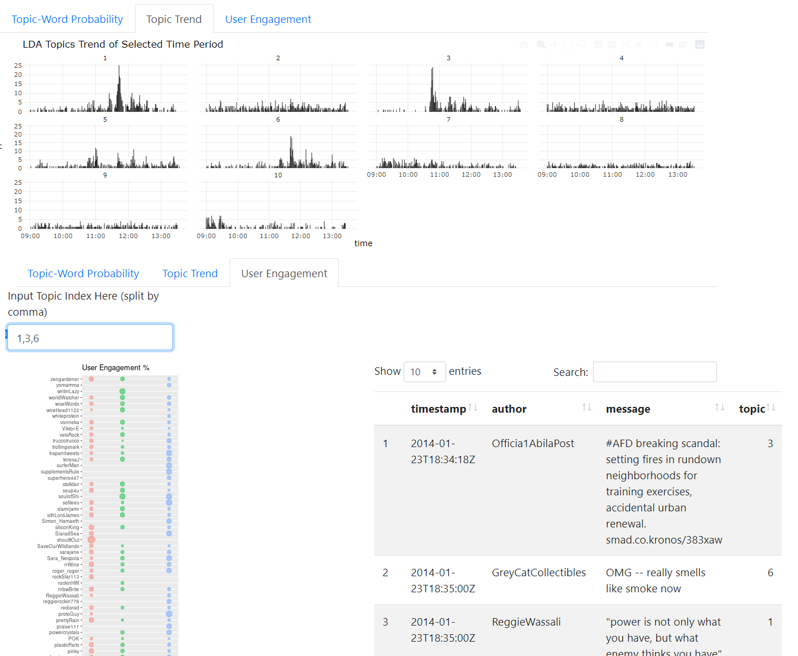
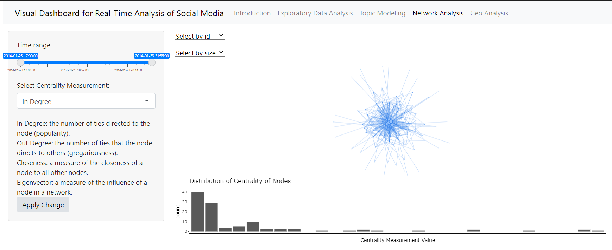

```{r, include=FALSE}
knitr::opts_chunk$set(echo = FALSE,
                      warning = FALSE,
                      tidy = FALSE,
                      message = FALSE,
                      fig.align = 'center',
                      out.width = "100%")
options(knitr.table.format = "html") 
```


# Introduction

Detecting abnormal events, such as disaster or crisis, from microblog social media has become a trend, as social media has played a pervasive role in the way people behave and think. Nowadays, people are also using time-stamped, geo -located data to share live information about what’s happening in their surroundings, which enables the public, government and researchers to identify abnormal events in community more quickly and take immediate actions.

To better analyzing and visualizing social media texts, several text analytics techniques can be applied, such as word cloud, topic modeling, network analysis, geospatial analysis and so on. In real-world practices, researchers have built various social media text visualization using different techniques, but their solutions lack an integrated way of working.  

In order to build a comprehend visualization dashboard with an interactive user interface, we built the application based on R shiny - a web application framework to create interactive web applications - and text analytical R packages.  


# Motivation

Our research is motivated by the lack of integrated and comprehensive real-time social-media dashboard. We aim to apply appropriate text analytics method and visually driven data analysis techniques in R language and R shiny to provide a handy analytic tool to help users understand the social-media posting through social media post analytics approaches.

# Approach

```{r, echo=FALSE, out.width="80%", fig.align='center'}
library(knitr)

```
```{r, echo=FALSE, out.width="80%", fig.align='center'}


```
```{r, echo=FALSE, out.width="80%", fig.align='center'}


```

# Datasets

VAST Challenge 2021 Mini-Challenge 3 poses a social media and text analysis challenge to detect the meaningful event reports, evaluate risk level, public influence and suggest team of first response based on location-stamped posts. It provides the collection of microblogs and emergency calls from the event day and geospatial map of the corresponding areas.

|No| Dataset | Information  |
|:-------|:-------------|:-------------|
|1 |Aliba.shp|Aliba geospatial map file with geometry information.|
|2 | csv-1700-1830,csv-1831-2000,csv-2001-2131 |Call Center and Blog information during time period from 1700 to 2131 on January 23,2014, with 5 variables – date, author, message, hotspot location, latitude and longitude |


# Dashboard Design

## Exploratory 

**Summary of datasets at glance**

```{r, echo=FALSE, out.width="70%", fig.align='center'}


```

• Temporal Pattern: Temporal pattern distribution of the number of posts from various source such as microblog posts vs. call center messages, tweets vs. retweets given the specific time period.

• Word Cloud based on frequency and cooccurrence rate: straightforward text analysis provides a overview of content being discussed and help to highlight past events that occurred from various sources


## Topic Modeling

**Customized parameters for LDA topic modeling**

```{r, echo=FALSE, out.width="70%", fig.align='center'}



```

By selecting time range and LDA topic modeling parameters, the text modeling will perform dynamically in the backend. With the LDA results, users can futher explores top meaningful words in each topic, identify the peaks of key major events at certain point of time through topic trend distribution and profile users based on their posts contributions to the topics.


## Network

```{r, echo=FALSE, out.width="80%", fig.align='center'}



```

With this VisNetwork object, we visuliaze the retweets network and draw the histograms of right skewed centrality distribution graph indicating patterns of the information dissemination. A variety of insights would be derived through different centrality measurements. For instance, most popular and active users could be identified by in-degree and out-degree centrality. And most influential users can also be detected by closeness and eigenvector centrality.  

## Geospaitial

```{r, echo=FALSE, out.width="80%", fig.align='center'}


```
To visually display the social media contents，we first plotted location-stamped text data from different resources on the leatlet map. Then we extracted hexagon binning map by using MMQGIS grid layer function in QGIS application.Subsequently, we identified the location-stamped posts intersection with the hexagon and counted the number of posts within each hexagon areas. By plotting the hexagon layer with color gradient over Aliba map, we then visualized the hexagon binning distribution map. 

# Insights 


# Conclusion and Future Work

In this work we presented an integrated visual analytics dashboard for public and government analysis of social media data. We applied multiple text mining and visualization techniques for social events response based on text content vitalization, network exploration and spatiotemporal analysis. For abnormal event response, we demonstrated a analyze flow to verify and examine the dashboard application. For future work, we will research and include more text mining techniques and provide more functional extension to the dashboard, and we hope to apply the concept of the framework design for more real-world text data analysis in response to time, entity relationship, and location. 

# Acknowledgement 

The authors want to thank Prof Kam Tin Seong of Singapore Management University for his valuable advice and support on this project.


```{r echo=FALSE, eval=FALSE}
library(pagedown)
pagedown::chrome_print("G9_poster.html")
```

