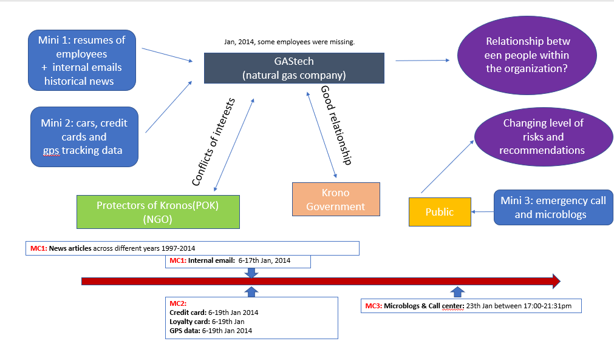
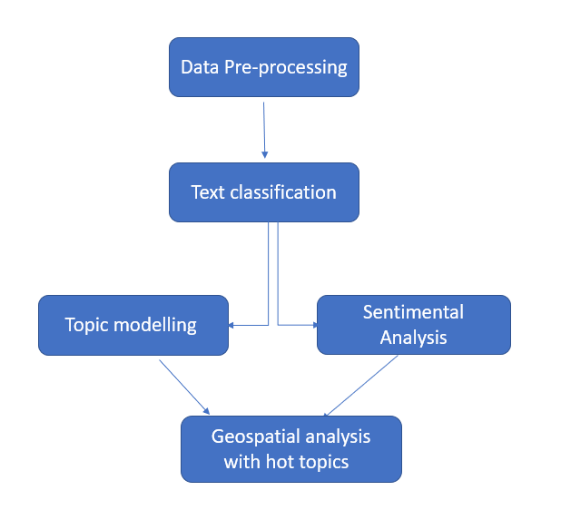
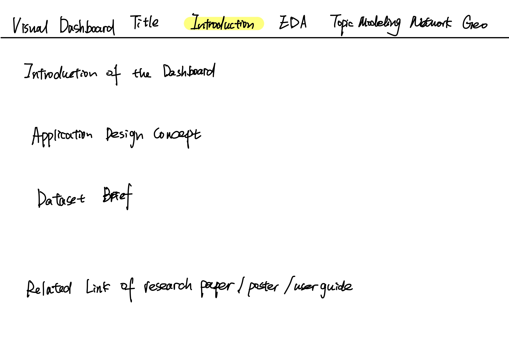
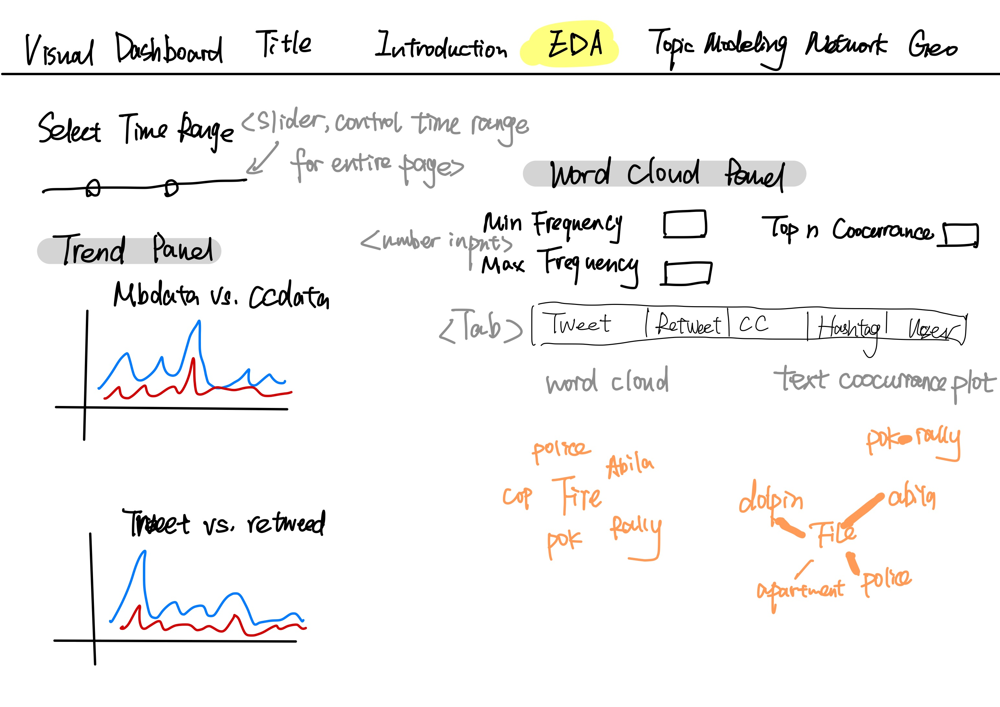
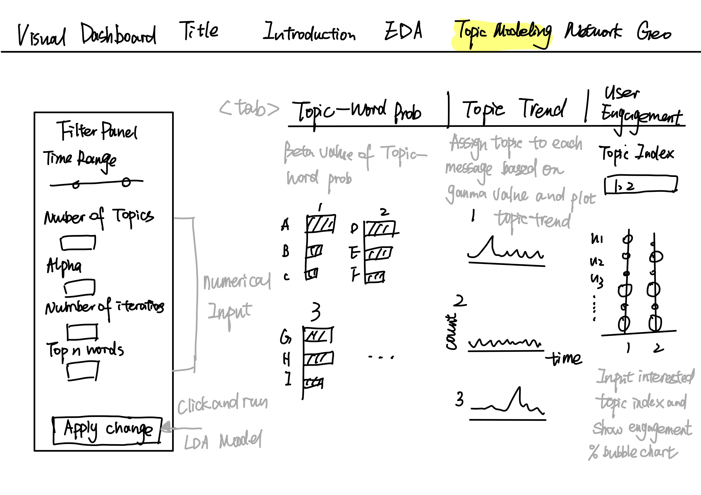
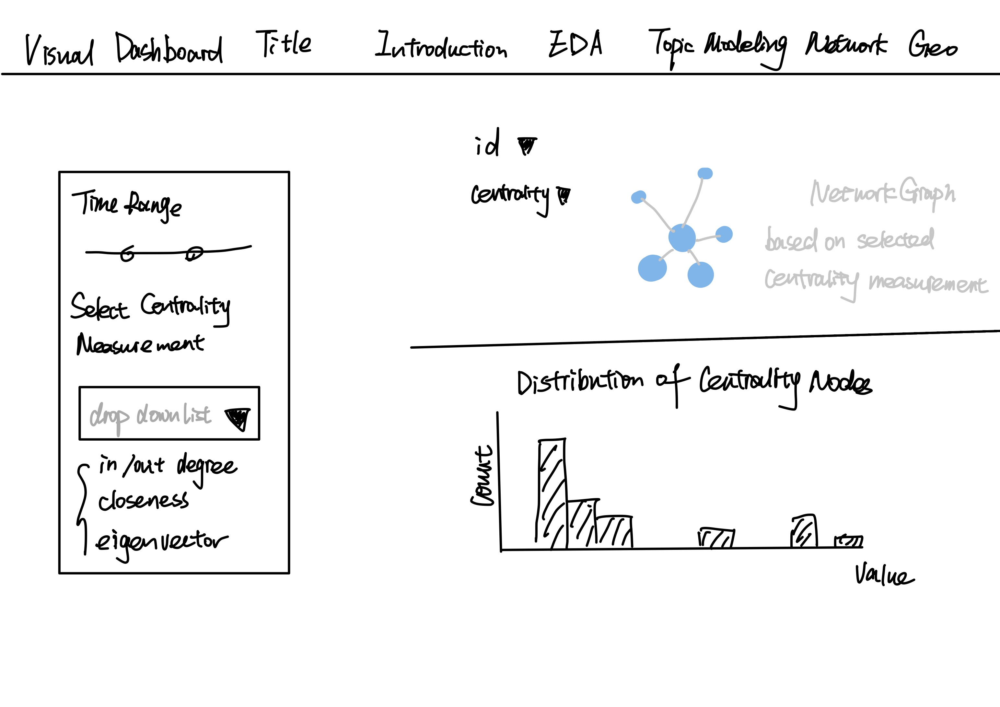
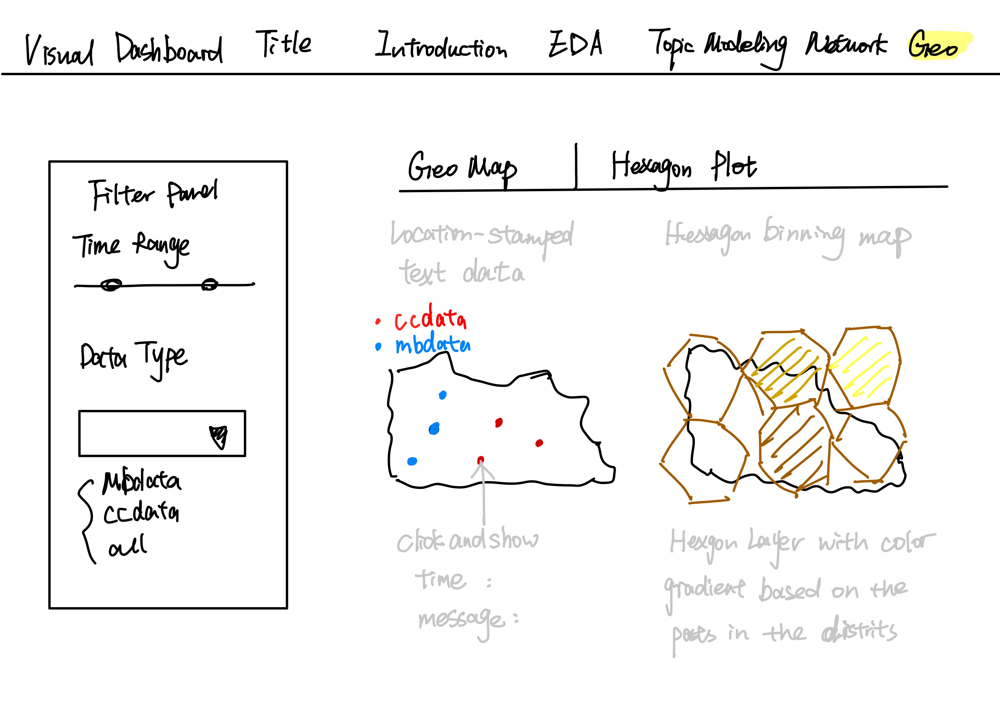

```{r setup, include=FALSE}
knitr::opts_chunk$set(echo = FALSE)

```
# Project Motivation

<center>

{width=70%}

</center>

Streaming online social media can be used to study crime detection problems. Combining geospatial information and suspicious social media post can help prevent and track the potential crimes, which has been widely used in many institutions. In this project, we will explore the microblogs data from 2021 IEEE VAST Challenge [Mini-Challenge 3](https://vast-challenge.github.io/2021/MC3.html) to evaluate the risks of any incidents that might occur at those hotspots over time, and subsequently recommend actions to local law enforcement


# Project Objectives





For this project, we will be using **both text and visual analytics approach** to analyze the available data and develop responses to the questions in VAST Challenge 2021 Mini-Challenge 3. We wish to understand ongoing incident text transcripts of emergency dispatches by the Abila, Kronos local police and fire departments, as well as local responses via the Micro blog. We will use interactive **R Shiny** dashboard to visualize real-time streaming social media data and geospatial data to make recommendations for further investigation.


# Datasets 

|No | Dataset | Information |
|:-:|:-----:|:-------------|
|1| Aliba.shp | Aliba geospatial map file with geometry information including longitude, latitude and location names.|
|2| csv-1700-1830, <br/>csv-1831-2000, <br/> csv-2001-2131 | Call Center and Blog information during time period from 1700 to 2131 Abila time on January 23,2014, with 5 variables - date, author, message, hotspot location, latitude and longitude |
|3| News Articles | Historical news reports on past events that consists of detailed documentation, timeline and location of events occurring.|


# Proposed Scope and Methodology

<center>

{width=70%}

</center>

### 1. Data Preparation

As the data given is unstructured, we will perform text pre-processing techniques to filter out and re-organize the textual data based on null values, manipulation of strings (lowercase, symbols, numbers), tokenization and stemming. This is to ensure all textual data are standardized for easier analysis.


### 2. Understanding Historical News Reports and Microblog Data

We will first provide **Exploratory Data Analysis (EDA) and Time-series Analysis** by basic statistical and world cloud visualization, which will provide a overview of content being discussed in microblog/call center, and help to highlight past events that occurred at certain areas, which we will be able to relate to real-time monitoring.

Additionally, we will then perform **Topic Modeling** techniques by Latent Dirichlet Allocation algorithm to understand topics generated from text data. These topics are words that can be in the form of unigram. To analysis the modeling results, user can select top n words to discover topics, understand topic distribution during the time period in the community and user engagement of each topic.

Then,a **Network Analysis** will be performed based on the re-tweet relationship between users to discover influential authors and unimportant users. We will also analysis the degree of the network and its distribution to help users explore and identify social relationships, interactions, and communications 

Moreover, we plan to apply visualization techiniques of **Hexagon Binning Map** discussed in research paper (Kam,BARSHIKAR,TAN 2012) to show real-time location-stamped text distribution in the community. By applying color with gradient, users can quickly locate the hexagon districts with the most number of posts and subsequently estimate the risk level in specific areas.


### 3. Storyboard & Visualizations for R Shiny










### 4. Visualizing from combination of Texts and Geospatial

As we wish to further visualize how the call center, microblog and historical news reports relate, our approach will be split into 3 parts: one for exploratory analysis,the other solely on text mining and lastly some geospatial analysis. 

- In the **first storyboard**, we would include brief introduction about the project, dashboard and include related project links.

- In the **second plot**, we wish to build a summarize dashboard for users to understand streaming trend in the selected time period and apply word cloud and text occurrence plots from various resources to help user understand the basic information from datasets at the first glance.  

- In the **third plot**, we wish to analyze the authenticity by performing topic modeling, as such users can have a better understanding of main topics and topic engagement in the community. This will allow us to detect any weird activity as well as evaluate event impact to various people. Filters including time range, LDA topic modeling parameters will also be added into the dashboard to make it customized based on selection.

- In the **forth plot**, we would like to analyze the retweet relationship based on network analysis. By analyzing the various centrality methods of the network and their distributions, we will help users explore and identify social relationships, interactions, and communications;

- Lastly, the **fifth plot**, we would like to determine how the hotspots’ location received by location-stamped posts from call center and microblogs.  In addition, we plan to leverage on the hexagon binning map distribution due to the lack of administration boundaries information in original geo map. By visualizing color with gradient, we hope users can quickly locate the hexagon districts with the posts information and subsequently estimate the risk level in specific areas. 


# Project Schedule and Plan


This is our overall plan towards working on the project and fulfilling the objectives stated.


# Software tools & R packages

### Software Tools:

- [RStudio](https://rstudio.com/)


### R Packages:

- [dplyer](https://dplyr.tidyverse.org/)

- [ggplot2](https://ggplot2.tidyverse.org/)

- [tidyverse](https://www.tidyverse.org/)

- [lubridate](https://lubridate.tidyverse.org/)

- [topicmodels](https://cran.r-project.org/web/packages/topicmodels/index.html)

- [tidytext](https://cran.r-project.org/web/packages/tidytext/index.html)

- [igraph](https://cran.r-project.org/web/packages/igraph/)

- [leaflet](https://cran.r-project.org/web/packages/leaflet)

- [tmap](https://cran.r-project.org/web/packages/tmap)

- [spdep](https://cran.r-project.org/web/packages/spdep)

- [rgeos](https://cran.r-project.org/web/packages/rgeos)

- [sf](https://cran.r-project.org/web/packages/sf)

- [sp](https://cran.r-project.org/web/packages/sp)

- [visNetwork](https://cran.r-project.org/web/packages/visNetwork/vignettes/Introduction-to-visNetwork.html)


---
# References

- [VAST Challenge 2021](https://vast-challenge.github.io/2021/MC3.html)

- [Visual Analytics Benchmark Repository](http://visualdata.wustl.edu/varepository/VAST%20Challenge%202014/challenges/MC2%20-%20Patterns%20of%20Life%20Analysis/)

- KAM, Tin Seong; BARSHIKAR, Ketan; and TAN, Shaun Jun Hua. DIVAD: [A Dynamic and Interactive Visual Analytical Dashboard for Exploring and Analyzing Transport Data](https://ink.library.smu.edu.sg/sis_research/1761/). (2012). International Journal of Computer, Electrical, Automation, Control and Information Engineering. 6, (11), 834-1353. Research Collection School Of Computing and Information Systems.


