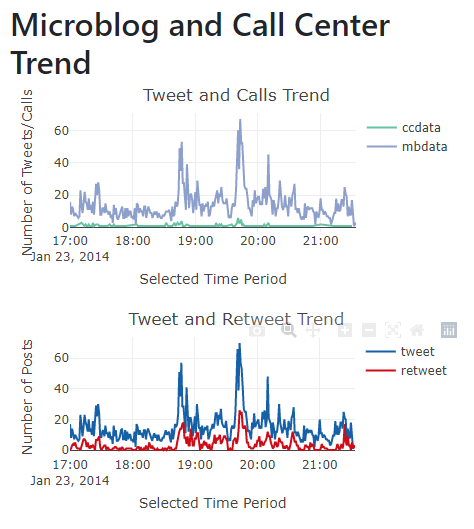
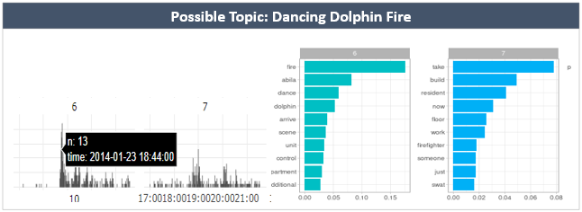

```{r, include=FALSE}
options(tinytex.verbose = TRUE)
```


# Introduction 

Detecting abnormal events ,such as disaster or crisis, from microblog social media has become a trend, as social media has played a pervasive role in the way people behave and think. Nowadays, people are also using time-stamped , geo -located data to share live information about what’s happening in their surroundings, which enables the public, government and researches to sense abnormal events in community more quickly and take immediate actions.

To better analyzing and visualizing social media texts,  several text analytics techniques can be applied, such as wordcloud, topic modeling, network analysis, geospail analysis and so on. In real-world practices, researchers has built various social media text visualization in different domain and lack of an integrated visualization.

In order to build a comprehend visualization dashboard with an interactive user interface, we buit the application based on R shiny - a web application framework to create interactive web applications - and text analytical R packages. 

This paper reports our research and development effort to the real-time social media microblog analysis. It consists of XXX sections. Section 1 provides a general introduction of the paper, followed by a motivation and objectives of the paper. Section 3 provides a literature review of related analytical techniques and Section 4 provides the discussion of analytical methods applied in our analysis and development. Then we will discuss the user interface and application design and provides examples of analysis flow. Lastly, the paper concludes with consideration of future improvement work.

# Motivation and Objectives

Streaming online social media can be used to study crime detection problems. Combining geospatial information and suspicious social media post can help prevent and track the potential crimes, which has been widely used in many institutions. Our research is motivated by the lack of integrated and comprehensive real-time social-media dashboard. We aim to apply appropriate text analytics method and visually driven data analysis techniques in R language and R shiny to provide a handy analytic tool to help users understand the social-media posting through various approaches, 

1) Exploratory Data Analysis (EDA) and Time-series Analysis by basic statistical and world cloud visualization, which will provide a overview of content being discussed and help to highlight past events that occurred at certain areas;

2) Topic Modeling techniques by Latent Dirichlet Allocation algorithm will be performed to understand topics generated from text data. And  topic trend and user engagement of each topic will be provided to understand the trend and public response to the topic;

3) Network Analysis will be performed based on the re-tweet relationship between users to discover influential authors. We will also analysis the various centrality methods of the network and their distributions to help users explore and identify social relationships, interactions, and communications;

4) Hexagon Binning Map discussed in research paper (Kam, BARSHIKAR, TAN 2012) will be applied to show real-time location-stamped text distribution in the community. By visualizing color with gradient, users can quickly locate the hexagon districts with the posts information and subsequently estimate the risk level in specific areas.

# Literature Review

Word clouds can provide an overview by distilling text down to those words that appear with highest frequency. In the research paper Word Cloud Explorer (Florian etl 2014), researchers have demonstrated an integrated word cloud dashboard including basic word cloud view, co-occurrence highlighting, term series, information, search panel as well as part-of-speech and named-entities. The extension usage of basic word cloud visualization has been transformed into a powerful tool for text analytics. We will selectively apply the general word cloud exploration techniques into real time social media dashboard development.
Topic modelling through Latent Dirichlet Allocation has been widely used in the industry for text mining. LDAvis (Chris etl 2014) is one of the most popular interactive web-based topic model visualization proving user interface of selection via number of topics and term and topic relevance. In consideration of the nature of social media streaming text, we will further analysis topic relationship with time series and users.

Network analysis has become increasingly popular to detect the interrelationships between actors of all sorts (Jesse, 2017). With the prevalence of social media, network analysis has expanded from real-life networks to the virtual networks in social media. In France and Christpoher's social network analysis of tweets during the Australian 2010-2011 (2011), they used tweets network to identify active players and their effectiveness in disseminating critical information via UCINet (Borgatti, Everett & Freeman 2002) and Pajek (Batafekj & Mrvar 1998). While the static network visualization failed to provide the users’ names and their importance in the graph. To overcome this, we will use visNetwork package in R in our project to create an interactive network and options of various centrality measurements for the users to explore. 

For spatiotemporal microblog visualization, some research has focused on visualization application on disaster events for public response, such as Junghoon et al. (2014), which provided an example of abnormal events detection through microblogs through spatiotemporal visualization, spatial analysis, interactive spatial decision support, temporal pattern and abnormal topic analysis. The heat map is useful in calculating the intensity of data points within the kernel but may have problems in handling large number of point data as discussed in paper DIVAD (Kam etal.2012) which suggested an alternative way by using hexagon binning map. The splitting the existing map by hexagon is an easy approach due to the lack of administrative boundary information. 

# Background and Datasets

VAST Mini-Challenge 3 poses a social media and text analysis challenge to detect the meaningful event reports, evaluate risk level, public influence and suggest team of first response based on location-stamped posts. It provides the collection of microblogs and emergency calls from the event day and geospatial map of the corresponding areas, details as below:

```{r, echo=FALSE, out.width="80%", fig.align='center', fig.cap="Table on details of dataset"}


```

# Analytical Methods

## Data Preprocessing

After loading the related text files, we use textclean, tm, tidytext packages in R to perform standard text preprocess steps, including lower case transformation, punctuation and stop words removal, retweet and hashtags retrieval by using regular expression techniques.

## Exploratory Data Analysis (EDA)

Temporal pattern distribution of the number of posts from various source such as microblog posts vs. call center messages, tweets vs. retweets given the specific time period. In addition, we will apply basic word cloud and co-occurrence plot to demonstrate straightforward text analysis based on its frequency and co-occurrence rate. With the basic line graph and word cloud, the visualization provides underlying insights and situation awareness overview.

## Topic Modeling Analysis

We apply the LDA function from the topicmodels package to create a LDA model with target number of topics and hyperparameter for topic proportions. This function returns an object containing the full details of the model fitting, including how words are associated with topics and how topics are associated with documents. With this model, we further extract the per-topic-per-word probability “beta” and present the top n most common words based on this beta value for every topic.  The second part of topic modeling is to show the trends of the topics over time by assigning each tweet a topic using the document-topic probability gamma. These trends imply the evolving change of topics with time, which useful to detect abnormal distribution peaks in certain time frames. Following by identifying the abnormal topics, we can investigate the tweets of those users most relevant to the topics via user engagement percentages.

## Retweet Network Analysis

By extracting retweets from the original data set, we constructed nodes using the usernames (authors) and edges with directions from the person who retweeted to the person who was being retweeted. With this VisNetwork object, we will be able to plot out the retweets network and draw the histograms of centrality distribution graph. From the distribution graph, we can tell the patterns of the information dissemination. VisNetwork contains different centrality measurements and thus a variety of insights would be derived. Most popular and active users could be identified by in-degree and out-degree centrality. And most influential users can also be detected by closeness and eigenvector centrality. 

## Geospatial Analysis

We first plotted location-stamped microblog data on the leaflet map to visually display the social media contents. The location and messages received from call center were also mapped with the Abila shape file (via extraction and st_intersection of cross junctions) and plotted onto the map.

Next, we extracted hexagon binning map of the Aliba area by using MMQGIS grid layer function in QGIS application and exported the Aliba hexagon shape file. Subsequently, we identified the location-stamped posts intersection with the hexagon and counted the number of posts within each hexagon binning areas. By plotting the hexagon layer with color gradient over Aliba map, we can then visualize the hexagon binning distribution map and identify “hotspots” area.

The plots are governed by time slider to show how the “hotspots” and messages changes across the evening. A more specific analysis can be done by selecting either the microblogs, call center or both.

# User Interface and Application Design


# Results Analysis and Discussion

The Shiny Dashboard was designed to incorporate interactivity and usability with different parameters for better analysis and understanding of the problem. In this section, we will focus on general analysis of events that occurred throughout the evening.

## EDA and Topic Modeling

### EDA

```{r, echo=FALSE, out.width="80%", fig.align='center', fig.cap="Overall trend of Microblogs and Call-Center messages across time"}


```

From initial exploratory analysis, we observe from the spikes that the frequency of microblogs and calls received are in synced. The number of retweets and tweets also corresponds to each other, most likely by people affected during that period of time. 

The top trending hashtags observed are “#POKRally” and “#KronosStar”, while “#DancingDolphinFire” and “#standoff” interestingly appears towards the end of the timeline. A deeper analysis of tagged user shows that top users such as “@centralbulletin” and “@newsonlinetoday”, which denotes the official accounts of Abila media outlets that are frequently tagged or retweeted by public.

### Topic Modeling

```{r, echo=FALSE, out.width="80%", fig.align='center', fig.cap="Topic Modeling analysis with Time"}




```

Topic Modeling using microblog data and with 10 topics of interest across the entire evening shows that the main events occurred were:

-	Fire at Dancing Dolphin building (from 6:40pm to about 8pm)
-	Black Van incident and Shooting Standoff at gelato galore (from 7:40pm onwards)
-	POK Rally event (from 5pm to 6pm, but tweets about it last the entire evening)

A brief approximation of the starting time for these events are denoted with spikes in time-series analysis.

## Network Analysis


## Geospatial Analysis

Given the event estimated starting time, we will filter the time accordingly so as to examine the flow of event as well as response time for call center. The location mapping allows detailed evaluation on whether the tweet message and call message are within the same vicinity and then compared with the timing for each.

### Event 1: POK Rally (around 5-6pm)

```{r, echo=FALSE, out.width="80%", fig.align='center', fig.cap="POK Rally Messages"}


```


From the map, we noted on the estimated location of where POK Rally occurs. By observation, there are almost no calls received about the Rally within the vicinity and time range. This shows that the rally was most likely peaceful and not violent or chaotic.


### Event 2: Fire at Dancing Dolphin building (around 6:40pm-8pm)

```{r, echo=FALSE, out.width="80%", fig.align='center', fig.cap="Microblog and Call messages for Fire Incident"}


```

We noted that the affected area has sudden increase in both microblogs and call messages received denoted by the hexagonal plot. Judging from the call message within the affected area, the first call received is at 6:40pm, and is in-synced with the estimated first microblog message related. Hence, the response time can be considered prompt, denoting the severity of the event.


### Event 3: Black Van Chase (around 7:20pm onwards)

```{r, echo=FALSE, out.width="80%", fig.align='center', fig.cap="Microblog and Call messages for Fire Incident"}

knitr::include_graphics("images/geo3.png")

```


Interestingly, the area where the black van first appear is within the Fire incident as well. Hence, these events might be interlinked. The first microblog message and the call center message received are within 1 minute apart, hence the response is considered relatively prompt.


### Event 4: 


# Conclusion and Future Work


# References

---
references:
- id: meier2012
  title: Professinal Android 4 Application Development
  author: 
  - family: Meier
    given: Reto
  type: book
  publisher: John Wiley & Sons, Inc.
  issued:
    year: 2012
    month: 5
- id: fenner2012a
  title: One-click science marketing
  author:
  - family: Fenner
    given: Martin
  container-title: Nature Materials
  volume: 11
  URL: 'https://doi.org/10.1038/nmat3283'
  DOI: 10.1038/nmat3283
  issue: 4
  publisher: Nature Publishing Group
  page: 261-263
  type: article-journal
  issued:
    year: 2012
    month: 3
...

